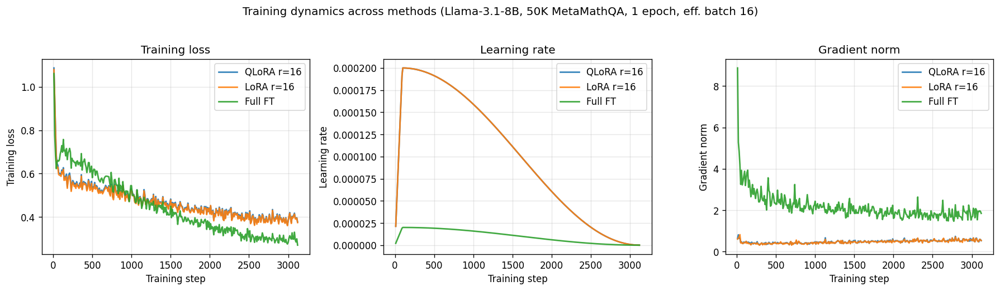

# Llama-3.1-8B Math Fine-tuning: QLoRA vs LoRA vs Full FT

Empirical comparison of three fine-tuning methods on **Llama-3.1-8B** for math reasoning, under identical hardware, data, and token budget. The interesting axis is the trade-off between **math gain** (GSM8K, MATH) and **catastrophic forgetting** of general knowledge (MMLU, HellaSwag).

**Status**: all 4 phases complete (baseline + QLoRA + LoRA bf16 + Full FT).

## Results

Baseline is raw Llama-3.1-8B without fine-tuning. Δ columns are vs baseline.

### Quality benchmarks (accuracy %)

| Method      | GSM8K | MATH | MMLU | HellaSwag | Δ GSM8K | Δ MMLU |
|-------------|------:|-----:|-----:|----------:|--------:|-------:|
| Baseline    |  48.9 | 13.4 | 66.8 |      73.2 |       — |      — |
| QLoRA r=16  |  68.2 | 14.3 | 65.9 |      69.6 |   +19.3 |   -0.9 |
| LoRA r=16   |  68.7 | 14.1 | 66.0 |      69.8 |   +19.8 |   -0.8 |
| Full FT     |  62.0 |  7.9 | 48.3 |      62.8 |   +13.1 |  -18.5 |

Numbers are pulled directly from [`eval_results/`](eval_results/) (lm-eval-harness JSON output). Metrics used:

- **GSM8K**: `exact_match,flexible-extract`, full 1319-item set, 8-shot
- **MATH** (`hendrycks_math`): `exact_match`, 500-item subset, 4-shot
- **MMLU**: `acc`, 500-item subset, 5-shot
- **HellaSwag**: `acc_norm`, 500-item subset, 10-shot

### System efficiency

Measured via W&B run summary + system-metric time series. Extraction script: [`src/extract_wandb_metrics.py`](src/extract_wandb_metrics.py). Raw output: [`results/system_metrics.json`](results/system_metrics.json).

| Method      | Hardware       | Peak GPU mem | Train time | Throughput      | Avg GPU util | Avg power | Final train loss | total FLOPs (per rank) | Cost   |
|-------------|----------------|-------------:|-----------:|----------------:|-------------:|----------:|-----------------:|-----------------------:|-------:|
| QLoRA r=16  | 1× A100 PCIe   |     35.5 GB  |    3.09 h  |  4.50 samples/s |       97.4 % |   380 W   |           0.376  |               7.77e17  |  $4.63 |
| LoRA r=16   | 1× A100 PCIe   |     64.8 GB  |    1.43 h  |  9.72 samples/s |       94.3 % |   380 W   |           0.374  |               7.77e17  |  $2.14 |
| Full FT     | 4× A100 SXM    |     73.9 GB  |    0.97 h  | 14.27 samples/s |       86.6 % |   315 W   |        **0.269** |               1.58e17  | ~$6.20 |

All runs use `effective_batch_size = 16` on the identical 50K seed=42 subset. QLoRA and LoRA's matching `total_flos` (7.77e17) confirms apples-to-apples compute on a single GPU. Full FT's per-rank FLOPs are ~1/4 because work is sharded across 4 GPUs via FSDP (system-wide ~6.3e17).

Peak GPU mem for Full FT is per-GPU after FSDP sharding (live state across 4 GPUs sums to ~296 GB — physically impossible on a single device, which is why FSDP is required). Cost is computed at $1.50/h for 1× A100 PCIe and ~$1.60/h per GPU for 4× A100 SXM.

### Training dynamics



What the curves show (generated by [`src/plot_wandb_curves.py`](src/plot_wandb_curves.py)):

- **Train loss**: QLoRA and LoRA bf16 overlap almost perfectly — direct visual confirmation that they share training dynamics. Full FT is noisier (much larger updates per step) but reaches the **lowest final loss** (~0.27 vs ~0.38), then loses every eval benchmark — train-vs-eval divergence is the visual signature of catastrophic overfitting.
- **Learning rate**: same cosine schedule with 3 % warmup for all three. LoRA-class uses peak LR 2e-4; Full FT uses 2e-5 (10× lower, barely visible against the same axis).
- **Gradient norm**: Full FT's gradients are **4-5× larger** (~2 vs ~0.5 for LoRA-class), with an early-training spike to ~8 before stabilizing. The contrast directly reflects the parameter count being updated — 8 B (Full FT) vs 42 M (LoRA/QLoRA) — and is the underlying reason Full FT needs 10× lower LR to be stable.

### Key findings

1. **QLoRA ≈ LoRA bf16 in quality, but LoRA is 2.16× faster and cheaper.** Final train loss differs by 0.7%, eval scores within 1 σ. The slowdown is purely QLoRA's per-forward NF4 dequant overhead — both methods saturate their GPU at ~95 % util, 380 W. QLoRA wins **only** when memory is hard-capped (35.5 GB vs 64.8 GB).

2. **Full FT *underperforms* LoRA on every benchmark — counterintuitive.** Despite reaching the **lowest train loss** (0.269 vs LoRA's 0.374), Full FT:
   - scores **6.7 pts behind LoRA** on GSM8K (62.0 vs 68.7) — the in-domain target,
   - **regresses below baseline** on MATH (-5.5 pts) — generalization collapsed,
   - **catastrophically forgets** general knowledge (MMLU **-18.5 pts**, HellaSwag **-10.4 pts**).
   
   LoRA's tiny parameter budget appears to act as **implicit regularization** that Full FT lacks — Full FT memorizes MetaMathQA's surface patterns at the cost of generality.

3. **The conventional Pareto framing is wrong here.** The standard story ("Full FT is highest quality, LoRA wins on efficiency") does *not* hold for this configuration. **LoRA bf16 is the dominant strategy on every axis except memory**: better quality, lower cost, less forgetting. Full FT only "wins" on wall-clock thanks to 4× GPU parallelism — and even there, at higher cost.

4. **Per-GPU throughput tells the opposite story from total wall-time.** Full FT processes 14.27 total samples/s, but only **3.57 per GPU** — *slower per GPU* than LoRA's 9.72 (single GPU). The wall-time win is pure parallelism. FSDP communication overhead also shows up as lower GPU util (86.6% vs 94-97% for single-GPU methods).

### When to pick which (this experiment, real-world recipe)

- **LoRA bf16** — the obvious winner. Best quality, lowest cost (~$2), identical training dynamics to QLoRA. Pick this if you have ≥80 GB VRAM.
- **QLoRA** — only if VRAM is hard-capped (e.g., 24 GB consumer GPU). 2× slower wall time and 2× more energy is the price of fitting in less memory.
- **Full FT** — **not recommended as configured**. Reaching the "expected" Full FT > LoRA outcome would require some combination of:
  - Lower learning rate (we used 2e-5; 5e-6 or 1e-5 might be more stable for 8B param SGD);
  - Anti-forgetting techniques (mix in general instruction data; KL regularization to base model);
  - More training data or different recipe (1 epoch on 50K examples may be insufficient for full-parameter updates on 8B);
  - These weren't tested here — left as the obvious follow-up.

### Caveats

- **Single seed.** All four results are from one run each. A rigorous claim would need multiple seeds + LR sweeps per method. The 18.5 pt MMLU drop for Full FT is far outside any plausible seed-noise envelope, so the *direction* is robust; the *magnitude* may shift on retraining.
- **Config asymmetry.** LoRA bf16 uses `gradient_checkpointing=false` (PEFT-frozen base + checkpointing breaks the grad chain unless `enable_input_require_grads()` is called); QLoRA uses `gradient_checkpointing=true` (handled automatically by `prepare_model_for_kbit_training`). A strict apples-to-apples memory comparison would require fixing the LoRA bf16 path.
- **Hardware difference for Full FT.** Full FT runs on 4× A100 80GB SXM (FSDP); QLoRA/LoRA on 1× A100 80GB PCIe. We standardized data, batch, and seed but not GPU count — Full FT couldn't physically fit on a single GPU. This affects wall-time but not the eval scores.
- **No hyperparameter tuning.** Each method ran a single configuration based on CLAUDE.md's initial spec. Full FT's poor result especially might be a learning-rate issue more than an architectural one.

## What's being compared

| Method        | Trainable params | Base in memory       | Notes                                                              |
|---------------|------------------|----------------------|--------------------------------------------------------------------|
| **QLoRA**     | ~42M (LoRA only) | 4-bit NF4 (~5 GB)    | Memory-efficient; lets a 7-8B model fit on a 16 GB consumer GPU.   |
| **LoRA bf16** | ~42M (LoRA only) | bf16 frozen (~16 GB) | Standard LoRA, no quantization overhead.                           |
| **Full FT**   | 8.07B            | bf16 trainable       | All parameters trainable; needs FSDP to shard across 4 GPUs (~74 GB/GPU). |

All three share the same training recipe: **50K MetaMathQA subset (seed=42), 1 epoch, effective batch 16, cosine LR with 3% warmup, max sequence 1024**. The only things that vary across methods are the learning rate, per-device batch size, and the quantization / parallelism setup. See [`configs/`](configs/) for exact hyperparameters.

## Setup

Tested on RunPod with A100 80GB pods and a 100 GB Network Volume mounted at `/workspace`.

```bash
git clone https://github.com/incisors/llama-math-finetune.git
cd llama-math-finetune
bash setup.sh
source ~/.bashrc                   # picks up HF_HOME on the network volume
huggingface-cli login              # needs Llama-3.1 access on your HF account
wandb login
```

## Reproduce a phase

```bash
# Phase 1: baseline eval (done — see eval_results/baseline/)
bash scripts/run_baseline.sh

# Phase 2: QLoRA training + eval  (~3h, 1× A100 80GB PCIe)
bash scripts/run_qlora.sh

# Phase 3: LoRA bf16 training + eval  (~4-5h, 1× A100 80GB PCIe)
bash scripts/run_lora.sh

# Phase 4: Full FT training + eval  (~1h train + ~1h eval, 4× A100 80GB SXM, FSDP)
bash scripts/run_full_ft.sh
```

## Repo layout

```
configs/                YAML hyperparameter configs, one per method
scripts/                Bash entrypoints per phase
src/
  prepare_data.py            MetaMathQA → 50K seed=42 → Problem:/Solution: format
  train.py                   YAML-driven training (qlora / lora / full_ft branches)
  eval.py                    lm-eval-harness wrapper for the 4 benchmarks
  utils.py                   seed, config loader, W&B init
  extract_wandb_metrics.py   Pull system metrics (peak GPU mem, util, power) from W&B
  plot_wandb_curves.py       Plot loss / LR / grad-norm curves across runs → results/training_curves.png
  merge_fsdp_checkpoint.py   Convert FSDP sharded checkpoint → HF format (one-off recovery utility)
eval_results/           Per-phase results.json from lm-eval (committed)
results/                Aggregated artifacts (system_metrics.json + training_curves.png — committed)
checkpoints/            Saved adapters / models (gitignored, multi-GB)
```

## Stack

PyTorch 2.4 (+CUDA 12.1), Transformers 4.45, PEFT 0.13, TRL 0.11, bitsandbytes 0.44, lm-evaluation-harness 0.4.5, W&B for live monitoring. Full pinned versions in [`requirements.txt`](requirements.txt).
